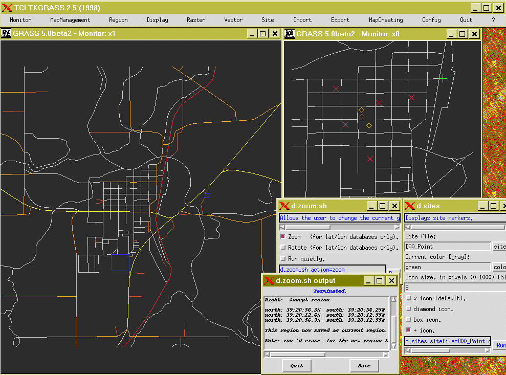

# Evolution of the GRASS GUI

## The 1980th

- Command line

## The 1990th

### Command line

GRASS GIS 4.3:

### XGRASS GUI

(never completed)

### Tcl/Tk-GRASS GUI (versions GRASS 4.2-6.3)

GRASS GIS 4.2.1:

GRASS GIS 5.0.beta2:

GRASS GIS 6.0.0:

GRASS GIS 6.4.4:

## Since the 2000th

### Command line

### wxPython GUI

Development started in 2007, GRASS 6.3 and later:

GRASS GIS 6.3:

GRASS GIS 8.4:

### Sources

Releases:

- GRASS GIS 4.2.1 history: <https://grass.osgeo.org/grass421/source/HISTORY.html>
- GRASS GIS release overview: <https://grass.osgeo.org/about/history/releases/>

Source code:

- Legacy GRASS source code for versions 3.2, 4.x, 5.x & 6.x: <https://github.com/OSGeo/grass-legacy>
- Current GRASS 8.x+ source code (and former 7.x): <https://github.com/OSGeo/grass>

Further screenshots:

- <https://github.com/OSGeo/grass-website/tree/master/static/images/gallery/gui/>
- <https://github.com/OSGeo/grass-website/tree/master/static/images/gallery/gui/archive/>
